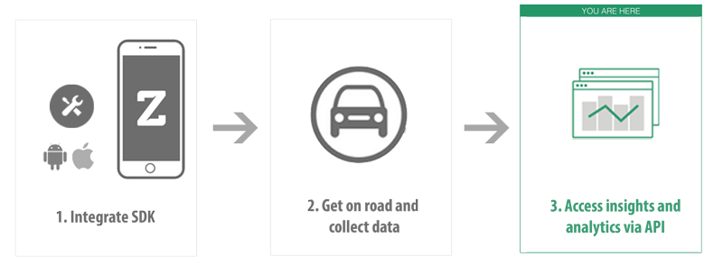

Introduction
------------

The Zendrive Driver Analytics API provides driver analytics metrics at various aggregation levels via URI paths. To use this API, your application should make a HTTPS request and parse the response. The response format is `JSON <http://www.json.org/>`_. Use standard HTTP GET methods to retrieve driver analytics. We support `cross-origin resource sharing <http://en.wikipedia.org/wiki/Cross-origin_resource_sharing>`_ to allow you to interact securely with our API from a client-side web application. **Remember that you should never expose your secret API key in any public website's client-side code**. JSON will be returned in all responses from the API, including errors.

Since the API is based on open standards, you can use any web development language to access the API.
